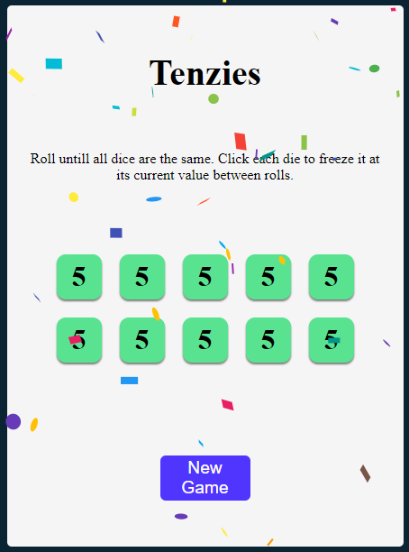

# Tenzies Game

It is well known as the world's fastest game. Very enjoyable and simple to learn. The objective of this dice game is to get all 10 of your dice to show the same number.
But the fun part of this game is that it allows for creativity. Loads of different ways to play. It’s fun, fast frenzy. It’s TENZI.

## Screenshot

  

  <a href="https://nabarvn.github.io/tenzies-game/">View Project</a>

## How to play?

> General Rules:

* There are ten dice to play with. This game is to be played by two to four players.
* All the players are required to choose a specific number between 1-6, to be frozen in each game.
* Each die is frozen by just clicking on it.
* The "Roll" button is used to roll the unfrozen die/dice by each player.
* At every attempt, the die/dice on which the chosen number appears, is/are frozen by the concerned player.

> Who wins?

* The player who hits the "Roll" button at last, just before all dice show the chosen number and are simultaneously frozen, is the winner. 
E.g.- All dice are showing the same number (5) and are collectively frozen -> It would denote that the last player to freeze the die/dice is the winner.

## Built with:

* HTML
* CSS
* JavaScript
* React.js

## Credits

Thanks to *Bob Ziroll* for motivating me and the much needed inspiration!
